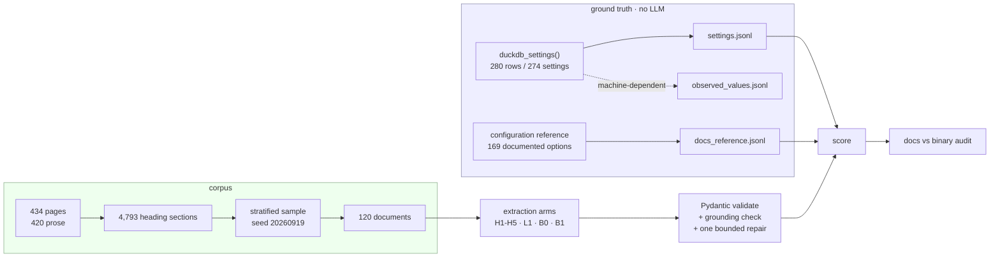

# structured-extract

> Extract validated, evidence-grounded records of DuckDB configuration settings from real documentation prose, and score every field against the binary's own `duckdb_settings()` — a free, exact oracle for 280 settings.

[](https://github.com/Prithv122/structured-extract/actions/workflows/ci.yml)

**Status:** complete. The full grid has run — 1,200 calls across 5 arms × 2
prompts × 120 documents, $2.0528 billed — and every response is committed, so
§5 replays offline with no API key.
**Stack:** Python 3.12 · `uv` · Pydantic v2 · duckdb 1.5.5 · OpenRouter · Ollama · pytest · ruff

---

## 1. The problem

Turning documentation prose into structured records is the most commercially
applied LLM pattern there is, and the hardest part of shipping one is not the
extraction — it is knowing whether the output is right. Most extraction demos
score against labels a human wrote in an afternoon, which measures agreement
with that afternoon rather than correctness.

This project picks a domain where the ground truth already exists and is exact.
DuckDB's own `duckdb_settings()` adjudicates whether a configuration setting
exists, what type it takes and what scope it has, for **280 settings, with zero
human labelling**. A hallucinated setting name becomes a hard count instead of a
judgement call. The by-product is useful in its own right: the same comparison
audits DuckDB's published configuration reference against the shipped binary.

## 2. The data

| | |
|---|---|
| Documentation | [`duckdb/duckdb-web`](https://github.com/duckdb/duckdb-web) @ `6f6cd16` (2026-09-06), 434 pages under `docs/current`, of which **420 are prose** |
| Oracle | `duckdb_settings()` from the `duckdb` Python package, **v1.5.5** |
| Licence | MIT (both) — Copyright 2018-2025 Stichting DuckDB Foundation |
| Corpus | 120 documents sampled from 4,793 heading sections, seed `20260919` |
| Refresh | one-off, pinned |

The 14 excluded pages are generated API reference — the `clients/c/` tree, the
Sphinx dump at `clients/python/reference/index.md`, and the docs landing page,
which is a grid of navigation tiles. They are HTML, not prose, and the two
families do not overlap: every excluded page carries 10–24 block-HTML tags per
1000 characters and every prose page carries ≤ 1.6.

The docs checkout's `_config.yml` sets `current_duckdb_version: "1.5.5"`, exactly
the installed `duckdb`. Documentation and oracle describe the same release, and
`scripts/fetch_source_docs.py` refuses to run if that stops being true — a docs
checkout one release ahead of the binary would produce "hallucinations" that were
really just version skew.

Not synthetic. Every document is a verbatim heading section of a real DuckDB
documentation page, committed with the page and heading it came from and a
sha256 that `corpus verify` re-checks.

## 3. Architecture



The oracle never reaches the extraction or repair path. The repair prompt sees
the document, the raw output, `ValidationError.errors()` and the schema —
nothing else. Feeding it the oracle would leak ground truth into the pipeline
and make the benchmark measure itself.

## 4. Key decisions & tradeoffs

| Decision | Chose | Over | Why |
|---|---|---|---|
| Ground truth | `duckdb_settings()` + the generated reference table | Hand-labelled records | Exact, free, 280 settings, zero labelling. The scarce human effort goes where no oracle can reach: 40 hand-labelled sections for *recall*, because "mentioned" and "documented" are different and only a person can tell them apart. |
| Defaults | The docs reference table | `duckdb_settings().value` | `value` is what the *build machine* runs — `threads` is its core count, `max_memory` a fraction of its RAM. Committing it would make the oracle non-reproducible and score models against one laptop. Kept separately in `observed_values.jsonl`, host-stamped. |
| Reference-table parser | Hand-written, assert at every step | `re.findall` over a row pattern | Measured on the real page: the regex silently drops **10 of 169 rows**, every one of them invisible. It survives as the `B0` baseline arm so "do you even need an LLM?" gets a fair answer. |
| Corpus unit | Heading sections of real pages | Whole pages, or synthetic paragraphs | Sections are what a reader consumes and fit a context window, so truncation policy does not become a confound. Prose stays exactly as shipped, tables and Jekyll markup included. |
| Stratum sizes | Measured, then rebalanced | The planned 55/35/30 | Only **19** extension pages contain a section naming a non-distractor setting. 35 was not obtainable without sampling the same pages four times; `extension-signal` is a census of all 19 and says so. |
| Distractors | Fixed 16 of 120 | Whatever the corpus produced | 60% of prose sections mentioning a "known setting" mention only `schema`/`user`/`username`/`password`/`threads`/`secret`. Left alone they took 54 of 90 prose documents. They are a real failure mode, sampled on purpose instead of by accident. |
| Pydantic | Yes, here | The `extract_json` + dataclass approach that [project 24](https://github.com/Prithv122/production-rag) chose | Not a reversal — a different layer. 24's payload was one flat field, where Pydantic would have duplicated `extract_json`. This payload is a nested list of records with closed enums, a pattern-constrained identifier and a cross-field uniqueness rule; `model_json_schema()` drives `response_format` so contract and validator cannot drift, and the per-field `ValidationError.errors()` list *is* the repair prompt's input. |
| Hallucination check | Leave `name` a free string | An enum of the 274 known settings | Putting the oracle in the schema would make a hallucinated name impossible to emit — and delete the benchmark's primary measurement. The schema must accept `frobnicate_cache`; scoring it wrong is the oracle's job, afterwards. There is a test asserting exactly this. |
| Grounding check | `evidence` must be a verbatim span of the document | An LLM judge, or trusting the model | Free, exact and unarguable, in the same way the oracle is. JSON Schema cannot express it, so the decoder enforces shape and a Pydantic validator enforces grounding — which means an arm can be perfectly schema-valid and still fail for quoting something the document does not say. Those are separate columns. Whitespace runs are normalised on both sides, because markdown hard-wraps mid-sentence; nothing else is. |
| Arm selection | Five hosted models, all with native structured outputs | A mix of structured and unstructured arms | Holding the mechanism constant means H1–H5 vary by capability alone. "Does constrained decoding help at all?" is a different question and belongs to the B0/B1 baselines. |
| The ceiling | `deepseek-v4-pro` | `claude-sonnet-5` | A grid with no strong arm cannot separate "this task is hard" from "these models are small", so a ceiling is not optional. But Sonnet was 76% of the cost and is the only candidate that accepts neither `temperature` nor `seed`. Decoupling "ceiling" from "frontier" made the grid 2.7× cheaper, one arm wider, and fully pinnable. |
| Determinism | Send only the knobs each provider advertises, and record which | Assume `temperature=0` works | It does not work everywhere — Sonnet 5 takes neither control, the GPT-5 family takes `seed` but not `temperature`. The client sends only what an arm advertises and `arms verify` fails if that changes, so the method section stays re-derivable rather than aspirational. |
| Repair vs retry | A `ValidationError` consumes the one repair; a 429 or 502 does not | One counter for both | A 502 is not a bad answer, it is no answer. Merging them would let a flaky provider look like a model that needs fewer repairs. |

## 5. Results

**1,200 calls — 5 arms × 2 prompts × 120 documents — $2.0528 billed, 239 tests
green.** Every raw response is committed, so every number below replays offline
with `OPENROUTER_API_KEY` empty: `uv run structured-extract report`.

### What this experiment establishes, stated narrowly

> Models can produce **perfectly grounded** extraction records while still
> returning **incorrect settings and incorrect structured attributes**. Stricter
> prompting can substantially reduce hallucinated settings, but may reduce
> recall.

Both halves are strongly supported below. What the grid does **not** establish
is that any one model is best. The ten cells vary vendor, architecture, price
and serving provider simultaneously; the design deliberately held the
*mechanism* constant (native structured outputs) rather than isolating any
single model property. Read the table as ten configurations, not a leaderboard.

### Headline

Recall is scored **only** on the 80 documents with exact ground truth — 35
reference-table rows and 45 hand-labelled prose sections. The other 40 prose
documents carry a proxy and are reported separately, never averaged in.

| prompt | arm | avail | halluc | recall | n | type | scope | **ground** | dflt kind | dflt value | cost |
|---|---|---:|---:|---:|:-:|---:|---:|---:|---:|---:|---:|
| v1 | H1 `deepseek-v4-pro` | 98% | 9% | **99%** | 83/84 | 63% | 94% | **100%** | 68% | 57% | $0.9429 |
| v1 | H2 `gemini-2.5-flash` | 98% | 39% | **99%** | 83/84 | 92% | **36%** | **100%** | 68% | 57% | $0.1041 |
| v1 | H3 `gpt-4.1-nano` | 98% | 28% | 74% | 62/84 | 85% | 93% | **100%** | 80% | 80% | $0.0185 |
| v1 | H4 `gpt-oss-120b` | 89% | 21% | 90% | 76/84 | 82% | 89% | **100%** | 67% | 60% | $0.0482 |
| v1 | H5 `glm-5.3-flash` | 91% | 34% | 83% | 70/84 | 88% | 92% | **100%** | 60% | 59% | $0.0091 |
| v2 | H1 `deepseek-v4-pro` | 99% | 2% | 94% | 79/84 | **56%** | 95% | **100%** | 64% | 52% | $0.8116 |
| v2 | H2 `gemini-2.5-flash` | 99% | 3% | 77% | 65/84 | 95% | **32%** | **100%** | 76% | 68% | $0.0632 |
| v2 | H3 `gpt-4.1-nano` | 98% | 32% | 63% | 53/84 | 86% | 96% | **100%** | 84% | 81% | $0.0193 |
| v2 | H4 `gpt-oss-120b` | 93% | 3% | 89% | 75/84 | 85% | 91% | **100%** | 61% | 51% | $0.0264 |
| v2 | H5 `glm-5.3-flash` | 93% | 2% | **92%** | 77/84 | 90% | 92% | **100%** | 67% | 65% | $0.0095 |

*v1 asks for the settings the document documents; v2 additionally specifies what
makes a mention count as documentation. Exact texts in `extract.py`.*

**Definitions.** *avail* — documents that produced any schema-valid, grounded
answer, including a correct empty one. *halluc* — share of returned records
whose `name` the binary has never heard of. *recall* — expected settings found,
on the 80 exact-truth documents. *type / scope / dflt* — accuracy **conditional
on the records an arm chose to return**, so an arm that returns little can score
well on fields while finding almost nothing (H3 does exactly this). *ground* —
`evidence` is a verbatim span of the document.

### Result 1 — grounding is free, and it does not buy correctness

**1,891 records across 1,200 calls, and the grounding rate is 100.0% in every
cell.** Not one record quoted text its document does not contain.

The same table shows H2 at **36% and 32% scope accuracy** and H1 at **63% and
56% type accuracy**. The models are reliably quoting the document and reliably
mislabelling what they quoted. That is this project's central point: a citation
is a check on *provenance*, not on *correctness*, and a pipeline shipping "every
claim is sourced" as its safety story has measured the easy half.

Grounding is enforced by a Pydantic validator, not by the JSON Schema — no JSON
Schema can say "this string must be a substring of that document". Shape and
grounding are separate columns because they are separate failures.

### Result 2 — the stricter prompt trades recall for precision

Measured on the 45 hand-labelled prose documents only, where "is this setting
actually documented here?" is a judgement and a person made it:

| arm | v1 hallucinated | v2 hallucinated | v1 recall | v2 recall |
|---|---:|---:|---:|---:|
| H1 | 6/59 | **0/49** | 50/51 | 46/51 |
| H2 | 20/77 | **0/35** | 50/51 | **33/51** |
| H3 | 14/46 | 14/43 | 29/51 | 26/51 |
| H4 | 8/61 | **0/47** | 48/51 | 44/51 |
| H5 | 14/54 | **0/46** | 37/51 | **45/51** |

Four of five arms fall to **zero** hallucinated records under v2. Four of five
also lose recall, and H2 loses a third of it — 50 found becomes 33. One prompt
change moved H2 from "finds nearly everything, invents a quarter of it" to
"invents nothing, misses a third". Neither is the right operating point in the
abstract; which one is depends on whether a false record or a missed record
costs more downstream, and this benchmark can price both.

**H5 is the one arm that improved on both axes** (14/54 → 0/46 hallucinated,
37/51 → 45/51 recall) and **H3 is prompt-immune** (14/46 → 14/43). Two
observations on a 45-document set with no seed re-draw; they are reported as
observations, not as rates.

### Result 3 — the catalogue price is a headline, not a quote

Cost was recorded two ways: `usage.cost` as billed by the provider, and an
estimate from the pinned per-token prices and the reported token counts. They
were expected to agree. Across the grid the pinned prices predicted **$1.1113**
against **$2.0528** billed — **1.85× out** — and the error is not uniform:

| arm | billed | predicted | ratio | reasoning tokens |
|---|---:|---:|---:|---:|
| H1 | $1.7545 | $0.6015 | **2.92×** | 634,733 |
| H2 | $0.1674 | $0.1677 | 1.00× | 0 |
| H3 | $0.0378 | $0.0383 | 0.99× | 0 |
| H4 | $0.0746 | $0.2814 | **0.27×** | 137,180 |
| H5 | $0.0186 | $0.0223 | 0.83× | 3,470 |

The two non-reasoning arms are exact. The reasoning arms are wrong in opposite
directions, for two different reasons:

- **Reasoning tokens are billed and are not inside `completion_tokens`.** H1 on
  `narrative-0002` reports 1,430 completion tokens and 1,475 reasoning tokens —
  the second cannot be a subset of the first. A cost model built on the
  documented token fields understates a reasoning arm, here by about 3×.
- **The advertised price is not the price charged.** H4 cost 0.27× its
  catalogue rate. With fallbacks disabled the request still lands on a specific
  provider, and that provider's rate is what reaches the bill.

Published figures are `usage.cost` throughout. The estimate is kept as a
cross-check precisely because it failed — a cost model nobody reconciles is a
cost model nobody knows is broken.

### Cost and latency

| arm | p50 | p95 | max | repairs | total |
|---|---:|---:|---:|---:|---:|
| H1 | 41.5 s | 154.5 s | 362.8 s | 24 | $1.7545 |
| H2 | 1.5 s | 4.1 s | 15.3 s | 6 | $0.1674 |
| H3 | 1.4 s | 4.9 s | 27.9 s | 7 | $0.0378 |
| H4 | 17.3 s | 232.6 s | **896.1 s** | 81 | $0.0746 |
| H5 | 4.9 s | 24.7 s | 261.4 s | 8 | $0.0186 |

**H1 is 85% of the bill** ($1.75 of $2.05) and 28× the median latency of the
fastest arm. Under v2 it reaches 94% recall at 2% hallucination for $0.81; H5
reaches 92% recall at 2% hallucination for **$0.0095**. Whether that gap is
worth 85× the price is a deployment decision — the point of building the oracle
was to be able to argue it with numbers.

### Schema validity and the one bounded repair

| | |
|---|---:|
| Valid on the first pass | **1,054 / 1,200 (88%)** |
| Repaired, then valid | 95 |
| Repaired, still invalid | 18 |
| Repairs used | 126 |
| Repair success rate | **75%** |

The repair is capped at one and never sees the oracle — it gets the document,
the raw output, `ValidationError.errors()` and the schema, nothing else.
**H4 spent 81 of the 126 repairs**, so "how often does this arm need a second
attempt" separates the arms far more sharply than final validity does.

### Failures, in full

- **13 `length_truncated` of 1,200 — but 8% of total spend.** Three are H1
  thinking until the budget is gone (`narrative-0001`: 16,185 reasoning tokens,
  $0.045, 343 s). Ten are H4, and those are a different failure wearing the same
  label: 559–1,147 reasoning tokens against 16,000 completion tokens is not
  deliberation, it is a whitespace repetition loop. One ran **896 seconds**.
- **20 `provider_error` of 1,200** — all HTTP 429, 18 on H5 and 2 on H4, every
  one `temporarily rate-limited upstream`. These are properties of this harness
  at this hour, not of the models: an earlier pilot under a 15-second backoff
  produced six such errors on H5 that an 85-second backoff recovered.
- **18 `invalid_after_repair`** — the one repair was spent and the output still
  did not validate.

`REQUEST_TIMEOUT` is a socket-inactivity timeout, not a deadline, which is how a
single call reached 896 seconds. That is a defect, recorded as one.

### Result 0 — the docs-vs-binary audit, which needed no model at all

| | |
|---|---:|
| Documented names unknown to the binary | **0** |
| Scope disagreements across 169 rows | **0** |
| Type disagreements across 169 rows | **0** |
| Core settings the reference page omits | **17** |
| Reference rows that require an extension | **32** |
| Settings in no reference table at all | **105** |

Reproduce with `uv run structured-extract oracle verify --detail`.

The DuckDB docs never invent a setting and never contradict the binary on type
or scope. They do omit 17 core settings — 11 `debug_*`, 3 `force_*`, and
`pandas_analyze_sample` / `python_enable_replacements` / `python_scan_all_frames`
— plausibly deliberate for the debug ones. And the reference page is generated
from a build with `httpfs` loaded without saying so, which is why 32 of its 169
"global configuration options" do not exist in a plain DuckDB.

### The arms

Every id, price and capability was resolved against OpenRouter's **public**
catalogue before a line of client code was written against it
(`structured-extract arms verify` — no key, no spend):

| Arm | Model | $/M in | $/M out | Role | Structured outputs | `temperature` + `seed` |
|---|---|---:|---:|---|:-:|:-:|
| H1 | `deepseek/deepseek-v4-pro` | 0.4223 | 0.8446 | ceiling | ✓ | ✓ |
| H2 | `google/gemini-2.5-flash` | 0.30 | 2.50 | mid-tier | ✓ | ✓ |
| H3 | `openai/gpt-4.1-nano` | 0.10 | 0.40 | small, non-reasoning | ✓ | ✓ |
| H4 | `openai/gpt-oss-120b` | 0.15 | 0.60 | open weights | ✓ | ✓ |
| H5 | `z-ai/glm-5.3-flash` | 0.090 | 0.300 | floor | ✓ | ✓ |

Five vendors, every arm on native structured outputs so the mechanism is held
constant, and every arm accepting `temperature=0` and a seed. No `:free` ids
anywhere — they are not the same endpoint. `z-ai/glm-5.2:free` reports
`structured_outputs=False`, `response_format=False` and a 32 k context against
the paid id's 1 M, so it cannot accept this schema at all, and `:free` carries
OpenRouter's 50-requests/day account-wide cap against 120 calls per arm.

### Limitations

Stated plainly, because a benchmark that hides these is worth less than no
benchmark.

1. **40 of 120 prose documents have no exact ground truth.** They are scored
   against a "mentions a known setting name" proxy that cannot tell *documented*
   from *mentioned in passing*, and it is **not merely biased low — it can
   invert.** On `narrative-0001` the correct answer is the empty set, and every
   arm that answered correctly was scored as having missed. The proxy is printed
   in the report and excluded from the headline by construction, not by
   convention.
2. **Seed sensitivity is unmeasured.** One draw, at seed `20260919`. Project 24's
   lesson was that the sampling band can be wider than the gaps in the table, and
   nothing here rules that out for the smaller gaps.
3. **n is small exactly where it matters most.** The prompt effect rests on 45
   documents and 51 expected settings. Differences of a few records are not
   rates, and are not reported as rates.
4. **`extension-signal` is a census, not a sample** — all 19 eligible pages — so
   no sampling band applies to it.
5. **L1 (local Ollama), B0 (the table parser) and B1 (the null arm) were not
   run.** B0 in particular would answer "do you even need an LLM for this?", and
   until it runs, that question is open.
6. **One pair of documents is textually identical** (`extension-0008` ==
   `narrative-0021`, across strata). Surfaced by `corpus verify`, left in place,
   and reported rather than quietly deduplicated after the numbers were in.
7. **20 of 1,200 calls returned no answer at all**, concentrated on one arm in
   one hour. The availability column describes this harness against these
   providers on 2026-09-20; it is not a vendor SLA.

## 6. How to run

```bash
git clone https://github.com/Prithv122/structured-extract.git
cd structured-extract
uv sync --all-groups
uv run pytest
```

That works offline, with no API key. **239 tests** check the committed oracle,
the corpus, the extraction schema, the repair ladder and the scorer, including a
cross-check of the committed core settings against a live plain `duckdb`. Two
further tests are marked `live` and deselected by default.

```bash
uv run structured-extract oracle verify --detail   # the audit above
uv run structured-extract corpus verify            # re-hash every document
uv run structured-extract corpus stats
```

The arms are pinned by exact model id and price. Checking them costs nothing —
OpenRouter's model catalogue is a public endpoint and needs no key:

```bash
uv run structured-extract arms verify
uv run structured-extract arms cost
```

Running the grid replays from the committed cache by default, so every published
number reproduces with `OPENROUTER_API_KEY` empty and no network:

```bash
uv run structured-extract extract run
uv run structured-extract extract run --pilot 8 --verbose
```

Every table in §5 comes out of one command, which reads the committed results and
re-scores them against the oracle from scratch — no stored scores are trusted:

```bash
uv run structured-extract report data/results/extractions.jsonl --detail 30
```

`--live` issues real, billed requests for anything not already cached. It is the
only command in this repo that spends money, and it refuses to start unless
`OPENROUTER_API_KEY` is set in the environment:

```bash
uv run structured-extract extract run --pilot 8 --live --verbose
```

One test reads the live catalogue to confirm the pinned ids still resolve. It is
deselected by default so the suite stays offline:

```bash
uv run pytest -m live
```

To rebuild the ground truth from scratch (needs network once, ~2 min for the
pinned docs checkout, plus DuckDB extension downloads):

```bash
uv run python scripts/fetch_source_docs.py
uv run structured-extract oracle build
uv run structured-extract corpus build --seed 20260919
```

Environment variables are listed in `.env.example`; neither is needed for
anything above.

## 7. What I'd change at 100× scale

100× here means 12,000 documents and ~120,000 calls. Six things break, in this
order.

**1. The loop is sequential, and that is the first wall.** 1,200 calls took
about ten hours, of which 8.6 h is pure provider latency. 100× is a thousand
hours in a straight line. The fix is bounded concurrency per arm behind a
per-provider token bucket — not unbounded, because the 429s this grid already
produced are what happens when you outrun a provider. The cache is already the
checkpoint, so workers can die and resume for free; that part needs no change.

**2. Drop the ceiling arm from the full sweep.** H1 was 85% of the bill for
recall that H5 nearly matches at 1/90th the price. At 100× that is $175 of a
$205 run spent on one arm. The right shape is: cheap arms over everything, the
ceiling arm over a stratified 1–2% sample, used to detect that the cheap arm has
drifted rather than to score the corpus. That turns H1 from 85% of spend into
roughly 1% and keeps the thing it actually buys — the ability to separate "this
task is hard" from "this model is small".

**3. Git is the wrong store for the cache.** 1,209 response blobs are fine in a
repo and make the replay claim trivially true. 120,000 are not. The cache moves
to content-addressed object storage with only the manifest — key, hash, cost,
token counts — committed. The replay guarantee stays; the thing being replayed
stops living in `git`.

**4. Hand labelling does not scale, so stop trying.** 45 labelled documents cost
a working session. 4,500 is not a plan. Two changes: make the exact-oracle
stratum (reference rows) carry the headline, since it grows for free with the
docs; and label by disagreement — when four arms agree, a human adds nothing,
and when they split, that is exactly the document worth a person's attention.
This grid already emits the disagreement signal; nothing consumes it yet.

**5. Put a deadline and a budget ceiling on the run.** `REQUEST_TIMEOUT` is
socket inactivity, not a deadline, which is how one call reached 896 seconds. A
runaway costs pennies at $2 and real money at $205. Both guards are cheap: a
hard per-call deadline, and an abort when cumulative `usage.cost` crosses a
declared cap.

**6. Report a sampling band, because at that budget there is no excuse not to.**
Every number here comes from one draw at one seed. Three seeds would cost 3× and
would let the arm ordering be stated with an interval instead of a caveat — and
on the evidence of project 24, some of the smaller gaps in the table would not
survive it.

One thing I would **not** change: the oracle. It is exact, free, and it scales
with the documentation rather than with a labelling budget. Every scaling
problem above is a throughput or money problem. None of them is a ground-truth
problem, and that was the point of choosing this domain.

---

## References

- DuckDB documentation and `duckdb_settings()`, both MIT — the corpus and the
  oracle. Sampled documents are verbatim excerpts; see `data/README.md`.
- No reference implementation was consulted for the extraction or scoring design.
